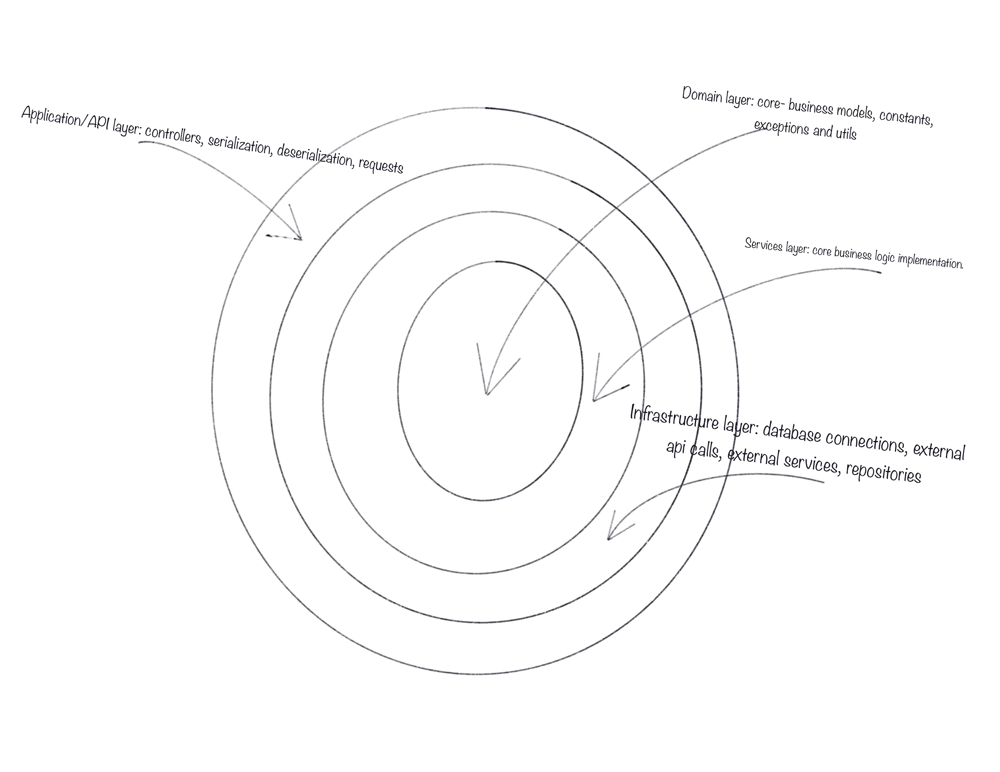

# Python onion architecture
Onion architecture is a design pattern that organizes the codebase 
of a software application into multiple layers, where the innermost layer 
is the domain layer and the outermost layer is the application layer. 
Each layer depends only on the layers inside of it and not on the layers outside of it, 
creating a separation of concerns, allowing for a more maintainable and scalable codebase.
The primary goal of this architecture is to make it easy 
to add new functionality or make changes to existing functionality 
without affecting the rest of the application.

In this article, we will show how to implement an onion architecture 
with Python, SQLAlchemy. We will start by creating a new Rust project, 
and then add the necessary dependencies. Next, we will create the core 
business logic layer, which will be responsible for handling the business 
logic of the application. We will then create the web layer, which will handle 
the web-specific logic, such as handling requests and responses. Finally, we will 
create the database layer, which will handle the database-specific logic, 
such as inserting, updating, and querying data.

## Layers
The onion architecture in this article consists of four layers:



## Architecture 
The application follows the Onion Architecture pattern.
This architecture is a design pattern that organizes the codebase 
of a software application into multiple layers, where the innermost layer 
is the domain layer and the outermost layer is the application layer. 
Each layer depends only on the layers inside of it and not on the layers outside of it, 
creating a separation of concerns, allowing for a more maintainable and scalable codebase.

This layered architecture can be seen translated to an application in the following diagram:

```
.
├── migrations
├── scripts
│   └── run_postgres.sh
├── src
│   ├── api
│   │   ├── controllers
│   │   │   └── ...  # controllers for the api
│   │   ├── schemas
│   │   │   └── ...  # Marshmallow schemas
│   │   ├── middleware.py
│   │   ├── responses.py
│   │   └── requests.py
│   ├── infrastructure
│   │   ├── services
│   │   │   └── ...  # Services that use third party libraries or services (e.g. email service)
│   │   ├── databases
│   │   │   └── ...  # Database adapaters and initialization
│   │   ├── repositories
│   │   │   └── ...  # Repositories for interacting with the databases
│   │   └── models
│   │   │   └── ...  # Database models
│   ├── domain
│   │   ├── constants.py
│   │   ├── exceptions.py
│   │   ├── models
│   │   │   └── ...  # Business logic models
│   ├── services
│   │    └── ...  # Services for interacting with the domain (business logic)
│   ├── app.py
│   ├── config.py
│   ├── cors.py
│   ├── create_app.py
│   ├── dependency_container.py
│   ├── error_handler.py
│   └── logging.py
```
The application is structured with the following components:

* api (app) module: The outermost layer that contains the controllers and the endpoints definition, serialization and deserialization of the data, validation and error handling.
* infrastructure: Layer that typically include database connections, external APIs calls, logging and configuration management.
* services: Layer that contains the application's services, which encapsulate the core business logic and provide a higher-level abstraction for the application to interact with the domain entities.
* domain: The innermost layer that contains the core business logic and entities of the application.
* migrations: Alembic's migration scripts are stored here.
* scripts: contains the application's configuration settings.

## Domain Layer
The domain layer is one of the main components of the onion architecture, it is 
responsible for representing the core business entities and their related business rules and logic. 
It is the core of the application and it should be independent of any external dependencies such as the 
database or the web framework. It's the most important layer as it defines the business entities and the
behavior of the system. Typically, the domain layer contains classes and interfaces that define the business entities, 
their properties, and their behavior. It also contains classes and interfaces that define the business rules and logic 
that are used to manipulate these entities. It should be easy to test and shouldn't have any dependencies on external 
systems, this way the domain layer is able to evolve and change independently of the other layers.

## Services Layer
The services layer is another key component of the onion architecture. It sits
between the domain and the infrastructure layers and provides an interface for 
the domain layer to interact with the infrastructure. The services layer 
contains the application's business logic, where it coordinates the use of 
domain entities and defines the overall flow of the application. It implements 
use cases, which are the entry points to the application's functionality and it 
acts as a bridge between the domain and the infrastructure layers. The 
services layer is responsible for validating inputs, handling transactions, 
handling security, and triggering domain events. It should not contain any 
\logic related to the UI or the persistence, this way it can be reused in 
different contexts. Services should be easy to test and should have no dependencies 
on external systems, this way the services layer can evolve and change 
independently of the other layers.

An example of a service is the following:


## Infrastructure Layer
The infrastructure layer is the outermost layer of the onion architecture. 
It is responsible for interacting with external systems such as databases, 
file systems, and web services. It provides the necessary functionality for 
the services layer to interact with these external systems. The infrastructure 
layer contains classes and interfaces that define the communication with 
external systems and handle the persistence of data. It also includes 
libraries and frameworks such as ORM, REST or WebSockets clients, and other 
libraries that interact with external systems. The infrastructure layer 
should be independent of the domain and the services layers, this way it can 
evolve and change independently of the other layers. The infrastructure layer 
should be easy to test and should have no dependencies on the domain and services 
layers, this way changes in the infrastructure does not affect the domain 
and services layers.